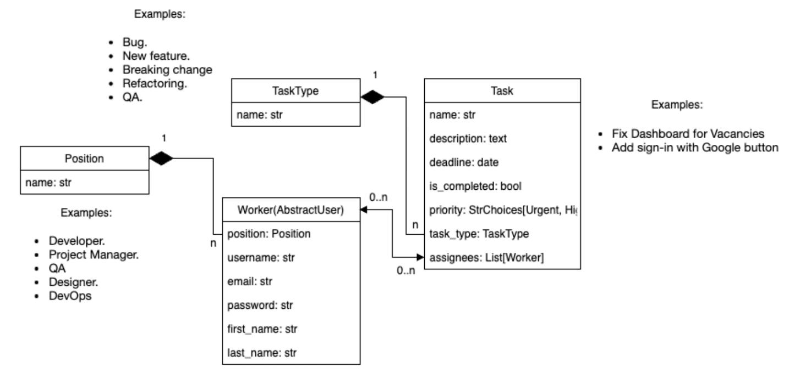

# Team Task Manager

Team Task Manager is a project management tool designed specifically for teams in the IT sphere. It allows developers, designers, project managers, and QA specialists to collaborate effectively on tasks related to product development.

With Team Task Manager, you can create tasks assign them to team members, and track their progress until completion. It helps streamline communication, ensures accountability, and keeps everyone on track to meet deadlines.

Key features include:

- Task creation: Easily create tasks with details and deadlines.
- Assignment: Assign tasks to team members and track who is responsible for what.
- Progress tracking: Monitor the status of tasks and ensure they are completed on time.
- Collaboration: Foster collaboration by allowing team members to communicate and share updates on tasks.
- Deadline management: Set deadlines for tasks and receive reminders to stay on schedule.
- Say goodbye to scattered task lists and communication gaps. With Team Task Manager, your team can stay organized, focused, and efficient throughout the product development process.

## Technologies Used

- Django
- HTML/CSS
- Bootstrap
- Python

## Database Schema

## Installation Instructions

1. Clone the repository: `git clone https://github.com/your/repository.git`
2. Navigate to the project directory: `cd your_project_directory`
3. Create a virtual environment: `python -m venv venv`
4. Activate the virtual environment:
   - On Windows: `venv\Scripts\activate`
   - On macOS and Linux: `source venv/bin/activate`
5. Install dependencies: `pip install -r requirements.txt`
6. Create a `.env` file in the project root directory.
7. Add your environment variables to the `.env` file. For example:
8. Run migrations: `python manage.py migrate`
9. Start the development server: `python manage.py runserver`
